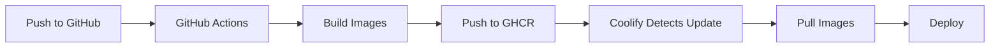

# Production Deployment Guide

This guide explains how to deploy Cognee using pre-built Docker images for faster deployments.

## Overview

Instead of building Docker images on every deployment (10-20 minutes), we use GitHub Actions to pre-build images and store them in GitHub Container Registry (GHCR). Coolify then pulls these pre-built images (1-2 minutes).

## Setup Steps

### 1. Enable GitHub Container Registry

Your repository is already configured! The workflow will:
- Build images on every push to `main` or `develop`
- Store images in GitHub Container Registry (GHCR)
- Use layer caching for faster subsequent builds

### 2. Make Container Images Public (Recommended for Free Tier)

**Option A: Public Registry (Free, no authentication needed)**
1. Go to your GitHub profile → Packages
2. Find packages: `cognee`, `cognee-mcp`, `cognee-frontend`
3. Package Settings → Change visibility → Public

**Option B: Private Registry (Requires authentication)**
- Keep images private (default)
- Configure Coolify with GitHub PAT (see below)

### 3. Configure Coolify

#### For Public Images (Easier):

1. In Coolify, create new Docker Compose project
2. Point to your repository
3. Set compose file: `docker-compose.production.yml`
4. Add environment variables:
```env
GITHUB_USERNAME=your-github-username
IMAGE_TAG=latest
POSTGRES_PASSWORD=your_secure_password
DB_PASSWORD=your_secure_password
```

#### For Private Images:

1. Create GitHub Personal Access Token (PAT):
   - Go to GitHub Settings → Developer settings → Personal access tokens → Tokens (classic)
   - Generate new token with `read:packages` scope
   - Copy the token

2. In Coolify project settings:
   - Add registry: `ghcr.io`
   - Username: your GitHub username
   - Password: your PAT token

3. Add environment variables (same as public)

### 4. Deploy

```bash
# Coolify will automatically pull pre-built images and start services
# No building required! 🚀
```

## Image Tags Strategy

The CI/CD workflow creates multiple tags for flexibility:

| Tag | Use Case | Example |
|-----|----------|---------|
| `latest` | Production (main branch) | `ghcr.io/username/cognee:latest` |
| `develop` | Staging/testing | `ghcr.io/username/cognee:develop` |
| `v1.2.3` | Specific version | `ghcr.io/username/cognee:v1.2.3` |
| `main-abc123` | Specific commit | `ghcr.io/username/cognee:main-abc123` |

### Using Different Tags

In Coolify environment variables:
```env
# Use latest stable
IMAGE_TAG=latest

# Use develop branch
IMAGE_TAG=develop

# Use specific version
IMAGE_TAG=v1.2.3

# Use specific commit
IMAGE_TAG=main-abc123
```

## File Structure

```
cognee/
├── docker-compose.yml              # Development (builds locally)
├── docker-compose.production.yml   # Production (uses pre-built images)
├── .github/workflows/
│   └── build-images.yml           # CI/CD workflow
└── PRODUCTION_DEPLOYMENT.md       # This file
```

## Deployment Workflow



## Local Testing with Pre-built Images

```bash
# Pull images from registry
docker-compose -f docker-compose.production.yml pull

# Start services
docker-compose -f docker-compose.production.yml up -d
```

## Troubleshooting

### Images not found
**Problem**: Coolify can't pull images  
**Solution**: 
1. Check images are public OR
2. Add registry credentials in Coolify
3. Verify `GITHUB_USERNAME` is correct

### Wrong image version
**Problem**: Old version is being used  
**Solution**:
```bash
# In Coolify, rebuild or:
docker-compose -f docker-compose.production.yml pull
docker-compose -f docker-compose.production.yml up -d
```

### Build failures in GitHub Actions
**Problem**: CI/CD workflow fails  
**Solution**:
1. Check workflow logs in GitHub Actions tab
2. Ensure Dockerfiles are valid
3. Check for syntax errors in workflow file

## Monitoring Builds

View build status:
1. Go to your GitHub repository
2. Click "Actions" tab
3. See latest workflow runs

Each push to `main` or `develop` triggers automatic builds.

## Cost Considerations

| Aspect | Free Tier | Notes |
|--------|-----------|-------|
| GitHub Actions | 2,000 minutes/month | Usually sufficient |
| GHCR Storage (Public) | Unlimited | Free for public images |
| GHCR Storage (Private) | 500 MB | May need paid plan |
| GHCR Bandwidth | Unlimited | No charges |

**Recommendation**: Use public images for open-source projects.

## Advanced: Multi-Stage Deployments

Deploy to different environments:

```yaml
# .env.production
GITHUB_USERNAME=your-username
IMAGE_TAG=latest
ENVIRONMENT=production

# .env.staging
GITHUB_USERNAME=your-username
IMAGE_TAG=develop
ENVIRONMENT=staging
```

## Benefits vs Building on Coolify

| Aspect | Pre-built Images | Build on Deploy |
|--------|-----------------|-----------------|
| **Deploy time** | 1-2 minutes | 10-20 minutes |
| **Server load** | Low (just pulls) | High (CPU/memory) |
| **Disk usage** | Minimal | Build cache grows |
| **Rollback** | Fast (change tag) | Slow (rebuild) |
| **Consistency** | Same image everywhere | May vary by environment |

## Next Steps

1. ✅ Push changes to GitHub
2. ✅ Wait for GitHub Actions to build images (~5-10 min first time)
3. ✅ Make images public (optional but recommended)
4. ✅ Configure Coolify with `docker-compose.production.yml`
5. ✅ Deploy! 🚀

## Support

For issues:
- Check GitHub Actions logs for build problems
- Check Coolify logs for deployment issues
- Verify environment variables are set correctly
